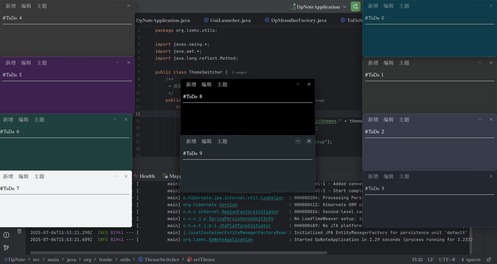

##### ToDo 桌面清单

```sql
# todo.sqlite
CREATE TABLE IF NOT EXISTS notes (
    id TEXT PRIMARY KEY NOT NULL,
    content TEXT NOT NULL,
    created_at TEXT DEFAULT (datetime('now', 'localtime')),
    updated_at TEXT DEFAULT (datetime('now', 'localtime'))
);
```

##### 截图

